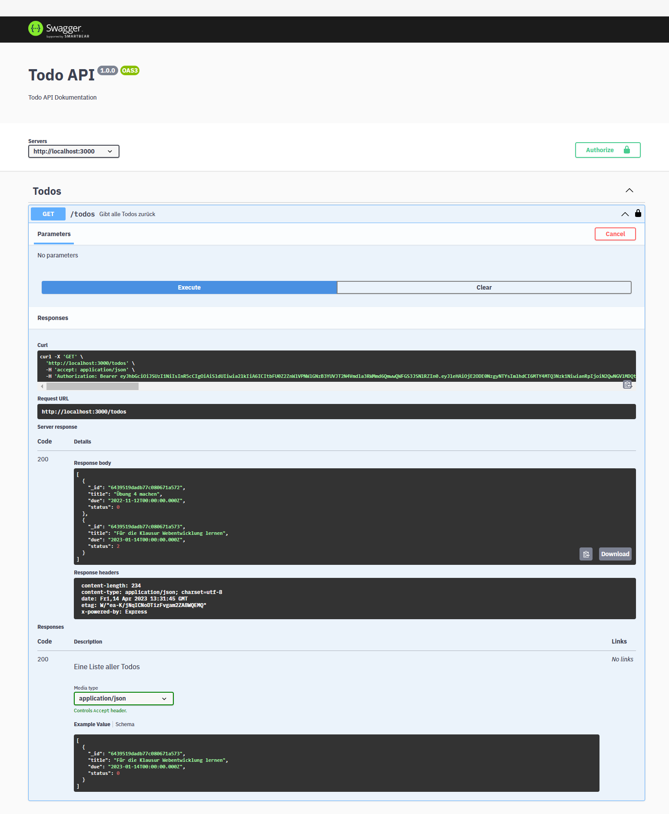

# Dokumentation mit OpenAPI / Swagger

## Aufgabe 1: Swagger-Dokumentation für das REST-API

Führen Sie die folgenden Schritte au, um eine Swagger-Dokumentation zu Ihrem Express.js REST API hinzuzufügen:

1. Installieren Sie die benötigten Pakete:

```bash
npm install swagger-ui-express swagger-jsdoc
```

2. Importieren Sie die Pakete in Ihrer Express-Anwendung (`index.js`):

```javascript
import swaggerUi from 'swagger-ui-express';
import swaggerJsdoc from 'swagger-jsdoc';
```

3. Erstellen Sie die Swagger-Options:

```javascript
const swaggerOptions = {
  swaggerDefinition: {
    openapi: '3.0.0',
    info: {
      title: 'Todo API',
      version: '1.0.0',
      description: 'Todo API Dokumentation',
    },
    servers: [
      {
        url: 'http://localhost:3000',
      },
    ],
  },
  apis: ['./index.js'], 
};
```

4. Erstellen Sie die Swagger-Dokumentation mit den angegebenen Optionen:

```javascript
const swaggerDocs = swaggerJsdoc(swaggerOptions);
```

5. Fügen Sie den Swagger-UI-Middleware hinzu:

```javascript
app.use('/api-docs', swaggerUi.serve, swaggerUi.setup(swaggerDocs));
```

6. Fügen Sie in Ihren Route-Dateien (`index.js`, sofern Sie Ihre Anwendung nicht weiter modularisiert haben) Kommentare hinzu, um die API-Endpunkte zu dokumentieren.
Hier ist ein Beispiel für die `/todos` GET-Route:

```javascript
/**
 * @swagger
 * /todos:
 *  get:
 *    summary: Gibt alle Todos zurück
 *    tags: [Todos]
 *    responses:
 *      '200':
 *        description: Eine Liste aller Todos
 *        content:
 *          application/json:
 *            schema:
 *              type: array
 *              items:
 *                $ref: '#/components/schemas/Todo'
 */
router.get('/todos', async (req, res) => {
  // Ihre Logik zum Abrufen der Todos
});
```

7. Definieren Sie die Schemas für Ihre API-Objekte, indem Sie sie zu den `swaggerOptions` hinzufügen:

```javascript
const swaggerOptions = {
  // ...
  components: {
    schemas: {
      Todo: {
        type: 'object',
        properties: {
          _id: {
            type: 'string',
            example: '6439519dadb77c080671a573',
          },
          title: {
            type: 'string',
            example: 'Für die Klausur Webentwicklung lernen',
          },
          due: {
            type: 'string',
            example: '2023-01-14T00:00:00.000Z',
          },
          status: {
            type: 'integer',
          },
        },
      },
    },
    securitySchemes: {
      bearerAuth: {
        type: 'http',
        scheme: 'bearer',
        bearerFormat: 'JWT',
      }
    },
  },
  security: [{
    bearerAuth: []
  }]
  // ...
};
```

8. Starten Sie Ihre Anwendung, und öffnen Sie `http://localhost:3000/api-docs` in Ihrem Browser, um die Swagger-Dokumentation zu sehen.

Wenn Sie alles richtig gemacht haben, sollten Sie über das Swagger-UI die `GET` Methode für `/todos` aufrufen können:


**Dazu müssen Sie zunächst wieder ein *Bearer-Token* generieren (s. Aufgabe vom letzten Mal) und sich über den Button *Authorize* anmelden.**

Mit diesen Schritten haben Sie eine grundlegende Swagger-Dokumentation für Ihre Express.js REST API erstellt. Sie können die Dokumentation weiter anpassen, indem Sie mehr Kommentare und Schemas für Ihre API-Endpunkte hinzufügen. Weitere Informationen finden Sie in der offiziellen [Swagger-OpenAPI-Dokumentation](https://swagger.io/specification/).

